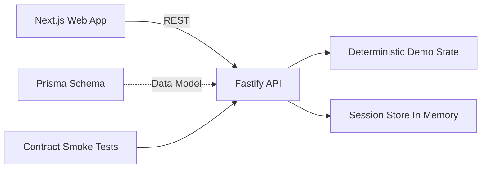

# Subscription Cancellation Guarantee

Detect. Cancel. Block. Prove.

Demo-first fintech workflow that helps users stop money leakage from hidden recurring subscriptions.


## 60-Second Pitch

Users lose money to forgotten recurring charges.
This product gives them one place to detect risky subscriptions, cancel quickly, block surprise renewals, and keep evidence for dispute workflows.

## Why This Matters

Most users do not lose money in one big payment.
They lose money through small, silent renewals they forgot about.

This project solves that exact problem by making the full cancellation workflow obvious, fast, and verifiable.

## What Problem We Solve

- Unexpected renewals that quietly drain monthly budget
- Slow and confusing cancellation workflows across merchants
- No single place to see risk, renewal dates, and cancellation state
- Weak proof trail when users need to dispute unwanted charges

## How We Solve It

- Demo-first authentication with zero external credentials
- Unified dashboard for monthly spend, risk level, and next renewal
- Subscription detail workflow with cancellation lifecycle and action controls
- Renewal calendar with risk color coding for proactive action
- Deterministic data and contract-tested APIs for stable demos

## Why Judges Usually Pause Here

- Clear business pain with measurable impact
- Full product flow works end-to-end on local setup
- Clean API contract + stable demo data makes evaluation easy
- UI is presentation-ready and built for fast understanding

## Winning Signal Checklist

- Pain is real, common, and expensive
- Flow is complete: detect -> cancel -> block -> verify
- Engineering quality is visible through contract checks and typed APIs
- Setup is no-drama and demo flow works immediately

## Core Demo Journey

1. Open landing page and understand value in under 10 seconds.
2. Login via demo auth with email + required PIN.
3. View dashboard metrics and high-risk subscriptions.
4. Open subscription detail, start cancellation, complete cancellation, and toggle auto-block.
5. Use Cancellation Center (Screen 10) to manage guided cancellation progress.
6. Use Protection Controls (Screen 11) to toggle Auto-Block status.
7. Review Alerts & Incident Feed (Screen 13) for severity-based triage.
8. Review renewal calendar and future charge exposure.

## Architecture Snapshot



## API Surface

Base URL: http://localhost:4000

- Health
	- GET /health
- Auth
	- POST /v1/auth/demo-login
	- GET /v1/auth/session
	- POST /v1/auth/logout
	- POST /v1/auth/demo-reset
- Dashboard
	- GET /v1/dashboard/summary
- Subscriptions
	- GET /v1/subscriptions
	- GET /v1/subscriptions/:id
	- POST /v1/subscriptions/:id/cancel
	- POST /v1/subscriptions/:id/cancel/complete
	- POST /v1/subscriptions/:id/block
- Renewals
	- GET /v1/renewals/calendar
- Cancellation Center (Screen 10)
	- GET /v1/cancellations/center
- Protection Controls (Screen 11)
	- GET /v1/protection-controls
	- POST /v1/protection-controls/:id
- Alerts Feed (Screen 13)
	- GET /v1/alerts/feed

Full contract documentation: apps/api/API_CONTRACTS.md

## 5-Minute Setup Guide

This setup is intentionally written to be copy-paste friendly.

### Fastest Path (Recommended)

```bash
npm run setup
npm run dev
```

Then open http://localhost:3000.

### 1. Prerequisites

- Node.js 20+
- npm 10+

Check quickly:

```bash
node -v
npm -v
```

### 2. Install Dependencies

From repository root:

```bash
npm run setup
```

### 3. Run The Full App

```bash
npm run dev
```

Expected ports:

- Web: http://localhost:3000
- API: http://localhost:4000

### 4. Verify In 30 Seconds

```bash
curl http://localhost:4000/health
npm run verify
```

If both pass, your setup is correct.

### 5. Demo Login

- Email: demo@devhouse.app
- PIN: 2026

## Project Structure

```text
.
├── apps/
│   ├── api/      # Fastify + TypeScript + Prisma schema + contract smoke tests
│   └── web/      # Next.js 14 UI app
├── package.json  # Monorepo-level scripts
└── README.md
```

## Commands You Will Actually Use

From root:

- npm run setup         -> install root + API + web dependencies
- npm run dev           -> run API + web together
- npm run verify        -> typecheck + API contract smoke + web lint + web build
- npm run build         -> build API and web
- npm run qa:e2e        -> run Playwright demo journey checks
- npm run docker:build  -> build production containers
- npm run docker:up     -> run API + web with health checks in Docker
- npm run health:smoke  -> verify local API + web health endpoints

## Judge-Friendly Quick Test

1. Run npm run dev.
2. Open http://localhost:3000.
3. Login and go to dashboard.
4. Open one subscription detail.
5. Open Cancellation Center and complete one pending flow.
6. Open Protection Controls and toggle one Auto-Block setting.
7. Open Alerts Feed and inspect one high-severity incident.
8. Open Renewal Calendar.

This validates key business value in less than 2 minutes.

## Tech Stack

- Frontend: Next.js 16, React 18, TypeScript, Tailwind CSS, Zustand
- Backend: Fastify, TypeScript, Zod validation
- Data Modeling: Prisma schema
- Tooling: npm scripts, contract smoke checks

## Troubleshooting

- Port already in use:
	- Kill process on 3000/4000, then run npm run dev again.
- Web loads but API calls fail:
	- Confirm API is running on 4000.
	- Check NEXT_PUBLIC_API_BASE_URL if overridden.
- Fresh machine setup fails:
	- Re-run all install commands from Setup Step 2.

## Team

DevHouse Hackathon 2026 Team

- pranjal
- bhavani
- yashaswini
- vishwas